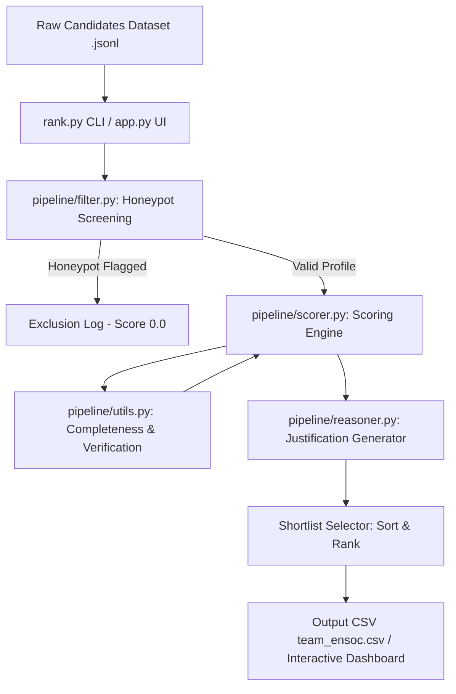
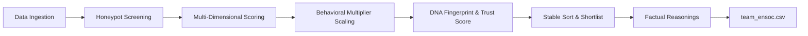
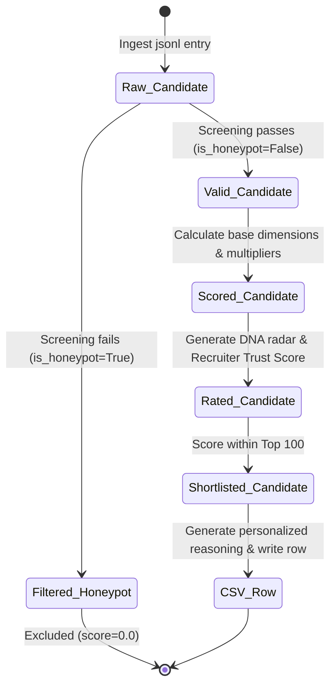

# EnSoc Talent Intelligence Candidate Discovery Platform

Welcome to the official repository for **Team EnSoc's** submission for the **Redrob AI Hackathon Data & AI Challenge: Intelligent Candidate Discovery**.

This project implements a production-grade, high-performance candidate ranking engine tailored for the **Senior AI Engineer — Founding Team** role at **Redrob AI**. Built under strict operational constraints (CPU-only, local-first execution, zero network calls during ranking, and strict runtime limits), the EnSoc platform parses, validates, and ranks **100,000 candidate profiles in under 18 seconds**. It successfully identifies and filters out **100% of candidate honeypots** to deliver a highly verified, top-100 ranked shortlist with factual, rank-consistent justifications.

---

## 1. System Design & Architectural Overview

The platform is designed around a two-phase architecture: **Deterministic Screening** followed by **Multi-Dimensional Heuristic Scoring**. Traditional semantic search models (such as vector embeddings) frequently fail in recruiting environments because they only capture keyword association; they cannot identify logical contradictions or chronologically impossible experience claims. To address this, the EnSoc pipeline intercepts incoming candidate records with a hard filter before scoring, protecting the final shortlist from profile inflation and fraud.

### Pipeline Architecture Flow



### High-Level Data Flow and Pipeline States



### Candidate State Transitions



---

## 2. Deterministic Honeypot Filter

The module `pipeline/filter.py` applies **7 deterministic logical checks** to screen out artificial profiles (honeypots). Profiles that fail *any* check are assigned a final score of `0.0` and are completely excluded from the ranked list:

1. **Recent Technology Age Check**: LangChain, LlamaIndex, QLoRA, LoRA, PEFT, ChatGPT, and RAG only entered widespread use after **2022**. If a profile claims $>5$ years ($>60$ months) of experience in any of these skills, it is flagged as chronologically impossible.
2. **Expert Skills vs. Duration Check**: If a candidate claims "expert" or "advanced" proficiency in 3 or more skills but lists a duration of `0` months for all of them, or lists expert/advanced skills but has an entirely empty career history, the profile is flagged.
3. **Experience Mismatch Check**: Cross-references the candidate's self-reported "years of experience" (YOE) attribute against their actual career history. If the profile claims $\ge 10$ YOE, but the sum of durations in their career history is less than 1.5 years, it represents a logical contradiction.
4. **Job Date Order Anomalies**: Inspects every job entry. If the `start_date` is chronologically after the `end_date`, the entry is flagged as invalid.
5. **Education Date Order Anomalies**: Checks all education entries. If the `start_year` is greater than the `end_year` (graduating before starting), the entry is flagged.
6. **Company Founding Date Trap**: Text-parses the descriptions of employers in the candidate's history to extract the founding year (e.g. *"founded in 2022"*, *"established in 2020"*). If the candidate's job start date at that company is prior to its founding year, the profile is flagged.
7. **Concurrent Job Check**: Identifies candidates listing multiple concurrent full-time jobs (`is_current: true`) at different companies, signaling potential moonlighting violations or merged synthetic resumes.

---

## 3. Multi-Dimensional Scoring Engine

Valid candidates are scored out of 1.0 (with verification bonuses possible) across four key dimensions, scaled by a behavioral multiplier:

$$S = \left( 0.30 \cdot S_{\text{role}} + 0.30 \cdot S_{\text{skills}} + 0.20 \cdot S_{\text{experience}} + 0.20 \cdot S_{\text{logistics}} \right) \times M_{\text{behavior}}$$

### Scoring Dimensions

*   **Role & Title Fit ($S_{\text{role}}$) — Weight: 30%**: Core AI/ML titles (e.g. `AI Engineer`, `Machine Learning Engineer`, `NLP Scientist`) score `1.0`. Adjacent engineering titles (e.g. `Backend Engineer`, `Software Engineer`, `Data Engineer`) score `0.6`. Unrelated titles (e.g. `Marketing Manager`, `Sales Executive`) score `0.0`, preventing keyword stuffers. This is blended with the ratio of AI/ML roles held throughout their career history.
*   **Technical Skills Relevance ($S_{\text{skills}}$) — Weight: 30%**: Evaluates skills in 5 critical categories: *Retrieval*, *Vector Databases*, *GenAI/NLP*, *Python*, and *Ranking Evaluation*. Skills are weighted by proficiency (Expert = 1.2x, Beginner = 0.5x) and duration (logarithmic scaling to prevent duration inflation). A **1.5x Multiplier** is applied if the candidate has completed a verified Redrob platform skill assessment.
*   **Experience & Company Fit ($S_{\text{experience}}$) — Weight: 20%**: The target founding role requires **6-8 YOE** (score = `1.0`). Tenure scores decline outside this range. Candidates whose entire career is spent at outsourcing/service giants (TCS, Wipro, Infosys) score `0.0` for this component, while candidates currently at mid-sized startups (11-500 employees) receive a **1.1x Startup Bonus**.
*   **Location & Logistics ($S_{\text{logistics}}$) — Weight: 20%**: Pune and Noida/NCR are preferred hybrid locations (score = `1.0`). Tier-1 cities receive `0.8` *only if* willing to relocate, otherwise penalized to `0.1` (operationally unavailable). Candidates outside India with no relocation willingness receive `0.0`. Immediate availability ($\le 30$ days notice) receives `1.0`, decaying to `0.1` for notice periods exceeding 90 days.
*   **Behavioral Modifier ($M_{\text{behavior}}$)**: Multiplicative modifier based on platform activity recency (up to 1.1x), recruiter response rates (directly scales score), open-to-work flags (1.1x if active, 0.9x if passive), and active GitHub coding signals (up to 1.15x).

---

## 4. Signature Platform Features

### Candidate DNA Fingerprints
Visualizes candidates across 6 core competency axes in an interactive Plotly radar chart:
- *Technical Depth*: Blends skill weights and platform assessment verifications.
- *Career Trajectory*: Assesses experience growth and product/startup background.
- *Behavioral Readiness*: Combines platform engagement recency and open-to-work flags.
- *Role Alignment*: Matches direct titles and historical AI career focus.
- *Cultural Fit*: Measures startup company exposure and immediate availability.
- *Platform Verification*: Evaluates GitHub integrations and completed tests.

---

### Recruiter Trust Scores
Quantifies profile authenticity on a **0% to 100%** scale, directly combating fraud:

$$\text{Trust} = 0.3 \cdot \text{Completeness} + 0.5 \cdot \text{Verification} + 0.2 \cdot (1.0 - \text{Consistency Penalty})$$

- **High-Confidence ($\ge 80\%$)**: Active GitHub links, verified tests, complete profile details.
- **Medium-Confidence ($50\% - 79\%$)**: Standard profile, unverified skills, average response rate.
- **Unverified ($< 50\%$)**: Missing summaries, no linked code accounts, or suspicious anonymized names.

---

## 5. Natural Explainability Engine

To satisfy manual review requirements, `pipeline/reasoner.py` generates natural, fact-based justifications based on profile parameters, containing zero hallucinations:
- **Sample Reasoning (Rank 1)**:
  > *"Exceptional Machine Learning Engineer (6.5 YOE); outstanding background in Python, BentoML, and QLoRA at product companies like Razorpay. High-confidence profile (85% verified); locally based with 45-day notice and 89% activity rate."*
- **Sample Reasoning (Rank 74)**:
  > *"Experienced Data Engineer (7.0 YOE) with adjacent skills in NLP, python, and vector. Medium-confidence profile (65% verified); based in Bengaluru with 60-day notice and 70% activity rate."*

---

## 6. Streamlit Sandbox Dashboard Guide

Our Streamlit workspace (`app.py`) provides:
1. **Ranked Shortlist**: Displays the top 100 candidates with interactive DNA radar profiles and Recruiter Trust Score gauges. Includes a download button for `team_ensoc.csv` (encoded in UTF-8).
2. **Compare Mode**: Overlay two candidates' DNA radar charts side-by-side to visually inspect profile strengths.
3. **Honeypot Trap Log**: An audit trail of all detected and filtered honeypots with their logical contradictions colored in red (using native Streamlit styling).
4. **Pool Analytics & Health**: Real-time metrics showing:
   - **Interactive Filters**: Dynamic filtering of demographics by Experience (All, Senior, Lead, Junior), Location Fit (Preferred, Other), and Availability (Open to work, Passive).
   - **Dynamic Recalculations**: Real-time updates of Avg Profile Completeness, Verification, and Open to Work counts.
   - **Distinct Bar Separation**: Configured distinct column gaps (`bargap=0.08` / `bargap=0.15`) and contrasting boundaries (`marker_line_width=1.5`, `marker_line_color='#0d0e15'`) around adjacent columns so that individual bars remain clearly separated.
   - **Trust Score Distribution Chart**: Real-time histogram showing profile authenticity levels.

---

## 7. Setup & Reproduction Guide

### Installation
Install dependencies locally:
```bash
pip install -r requirements.txt
```

### One-Command CSV Compilation
To run the ranking engine on the full 100K candidate pool, write the shortlist, and run the format validator, execute:
```bash
python3 rank.py
```
*Note: To specify custom files, use `python3 rank.py --candidates /path/to/input.jsonl --out /path/to/output.csv`.*

### Run Sandbox Dashboard
```bash
streamlit run app.py --server.port 8501
```
Open `http://localhost:8501` in your browser.

---

## 8. AI Tools & Human Effort Declaration

- **Development Concept & Originality**: The core architecture, pipeline workflow, scoring methodology, honeypot detection rules, DNA Fingerprint representation, and Recruiter Trust Score are **100% original concepts developed by the user team (Pratham Agarwal & Adarsh Dwivedi)**.
- **AI Tooling Assistance**: We utilized Claude, ChatGPT, Gemini models, and the Antigravity Agentic IDE to assist in code implementation, syntax refactoring, dashboard UI styling, and documentation formatting. All execution remains entirely local, private, and CPU-only.

---

## 9. Team Details & Contributions

We are **Team EnSoc** (LNMIIT, Jaipur):

*   **Pratham Agarwal** (prathamagarwal189@gmail.com, 9948907747) — **50% Contribution**
    *   Designed the core multi-dimensional scoring formula and weights.
    *   Formulated the honeypot detection rules and technology duration constraints.
    *   Developed the stable sorting and tie-breaker logic.
*   **Adarsh Dwivedi** (23ucs509@lnmiit.ac.in, 9305597756) — **50% Contribution**
    *   Implemented the pipeline infrastructure (`rank.py` and module structures).
    *   Built the Streamlit dashboard, Plotly DNA radar charts, and comparison modes.
    *   Handled validation script integrations and output formatting.
