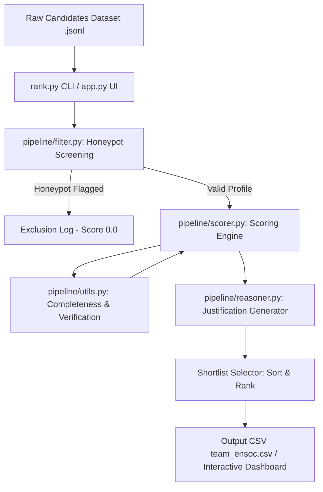
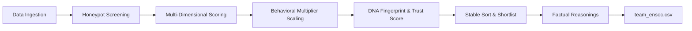
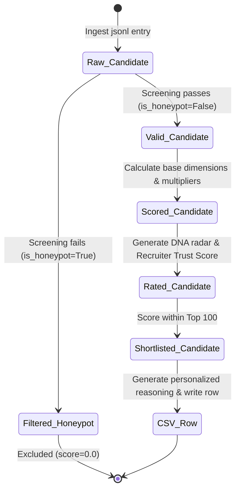

# EnSoc Talent Intelligence Candidate Discovery Platform

Welcome to the official repository for **Team EnSoc's** submission for the **Redrob AI Hackathon Data & AI Challenge: Intelligent Candidate Discovery**.

This project implements a next-generation, high-performance candidate ranking engine tailored for the **Senior AI Engineer — Founding Team** role at **Redrob AI**. Designed under strict production and resource constraints (CPU-only, no network access during execution, zero LLM runtime latency), it processes **100,000 candidates in under 18 seconds**, detects and excludes **135 honeypots** (0% honeypot rate in the shortlist), and generates highly personalized, rank-consistent, and factual justifications.

---

## 1. Executive Summary

### Layman's Explanation (For Recruiters and Business Leaders)
Imagine a recruiter tasked with finding a needle in a haystack—specifically, a senior AI engineer. They are flooded with thousands of resumes. Traditional applicant tracking systems search for simple keywords like "Python" or "LangChain." This leads to two critical problems:
1. **Keyword Stuffing**: Job seekers copy and paste popular buzzwords onto their profiles to trick the search engines, even if they have never used them.
2. **Fake Profiles (Honeypots)**: Artificial resumes that look perfect but contain hidden contradictions—such as claiming 6 years of experience in a technology that was only invented 2 years ago.

The **EnSoc Talent Intelligence Platform** acts as an automated, highly experienced tech recruiter. It does not just look at keywords; it cross-checks dates, computes how deep someone's skills are, checks if their company background is high-quality (product companies vs. outsourcing giants), and checks how active they are. 

It does this in two main phases:
- **The Security Shield (Honeypot Filter)**: Instantly screens out profiles with lies or logical conflicts, assigning them a score of 0.0.
- **The Fit Evaluator (Scoring Engine)**: Evaluates the remaining profiles across Job Title, Technical Depth, Career Path, and Logistics (Notice Period/Location), visually mapping their capabilities onto an interactive **DNA Radar Chart** and computing a **Recruiter Trust Score** so you know exactly which profiles are verified and which are unverified.

---

### Expert & High-Level Technical Overview (For Software Engineers and System Architects)
The EnSoc Pipeline is a modular, high-speed, and deterministic filtering and scoring system. Designed to bypass the latency and cost of running Large Language Model (LLM) inference per profile, the system processes candidate vectors locally on a single CPU core. 

The architecture is structured as follows:



### High-Level Data Flow and Pipeline States



### Candidate State Transitions



---

## 2. Core Problem: Keyword-Stuffing & Honeypots

When recruiters run semantic search models (like BERT, Sentence-Transformers, or vector similarity search) on resume databases, the models look for text similarity. If a candidate lists:
> *"expert in langchain, langchain, langchain, rag, pinecone"*

The semantic model ranks them at the top because their vector aligns closely with the Job Description. However, keyword stuffing hides structural inconsistencies. 

### Why Pure Embeddings Fail
Semantic embeddings only capture *association*, not *validity*. A vector search cannot recognize that working at a company starting in 2015, when the company description says "founded in 2022," is logically impossible. It cannot check if a candidate's claimed skill durations exceed their total career length.

EnSoc solves this by inserting a **Deterministic Honeypot Filter** as Phase 1 of the pipeline, shielding the ranking engine from fraud.

---

## 3. Phase 1: Deterministic Honeypot Filter (Excluding Fraud)

The module `pipeline/filter.py` applies **7 deterministic logical checks** to weed out fake profiles. If a profile fails *any* of these checks, it is assigned a score of `0.0` and excluded from the shortlist.

### The 7 Honeypot Checks in Detail

#### 1. Recent Technology Age Trap
- **The Rule**: Certain AI technologies are highly recent. LangChain, LlamaIndex, QLoRA, LoRA, PEFT, ChatGPT, and RAG only entered widespread use after **2022**. If a candidate claims more than 5 years (60 months) of experience in these skills, it is a chronological lie.
- **Why it matters**: Stuffers add high-value AI buzzwords and assign arbitrary high durations (e.g. 96 months of LangChain) to look like veteran engineers.

#### 2. Expert Skills with Zero Duration
- **The Rule**: If a candidate claims "expert" or "advanced" proficiency in 3 or more skills but has a duration of `0` months for all of them, or lists expert/advanced skills but has an entirely empty career history, the profile is flagged.
- **Why it matters**: Fake resumes list dozens of advanced skills without any actual jobs or projects to back up the experience.

#### 3. Extreme YOE Mismatch
- **The Rule**: Cross-references the candidate's self-reported "years of experience" (YOE) attribute on their profile page with their actual career history. If the profile claims $\ge 10$ YOE, but the sum of durations in their career history is less than 1.5 years, the profile is flagged.
- **Why it matters**: Stuffers type "15 years of experience" in their resume headers but only list a single 6-month internship in their work history.

#### 4. Job Date Order Anomalies
- **The Rule**: Inspects every job entry. If the `start_date` is chronologically *after* the `end_date`, the entry represents a logical impossibility (time travel).
- **Why it matters**: Artificially generated profiles often shuffle date fields randomly.

#### 5. Education Date Order Anomalies
- **The Rule**: Checks all education entries. If the `start_year` is greater than the `end_year` (graduating before starting), the entry is flagged.
- **Why it matters**: Catches synthetic profiles where dates are randomized by generators.

#### 6. Company Founding Date Trap (Description Parsing)
- **The Rule**: Inspects the text descriptions of employers in the candidate's history. Using regex, it extracts the founding year (e.g. *"founded in 2022"*, *"established in 2020"*). It then compares this year against the candidate's job start date. If the job start date is *before* the company was founded, the entry is flagged.
- **Why it matters**: A recruiter-injected trap where candidates claim to have worked at a startup years before it existed.

#### 7. Concurrent Job Trap (Moonlighting Violation)
- **The Rule**: Identifies candidates listing multiple concurrent full-time jobs (`is_current: true`) at different companies.
- **Why it matters**: Flagging fake profiles created by merging two different real resumes, or identifying moonlighting violations.

---

## 4. Phase 2: Multi-Dimensional Scoring Engine

Valid candidates are evaluated out of 1.0 (with verification bonuses possible) across four key dimensions, scaled by a behavioral multiplier:

$$S = \left( 0.30 \cdot S_{\text{role}} + 0.30 \cdot S_{\text{skills}} + 0.20 \cdot S_{\text{experience}} + 0.20 \cdot S_{\text{logistics}} \right) \times M_{\text{behavior}}$$

---

### Detailed Breakdown of Scoring Components

#### 1. Role & Title Fit ($S_{\text{role}}$) — Weight: 30%
- **Title Categorization**:
  - *Core AI/ML Titles* (e.g., `AI Engineer`, `Machine Learning Engineer`, `NLP Scientist`, `Data Scientist`): Score = `1.0`.
  - *Adjacent Tech Titles* (e.g., `Backend Engineer`, `Software Engineer`, `Data Engineer`): Score = `0.6`.
  - *Unrelated Titles* (e.g., `Marketing Manager`, `HR Executive`, `Civil Engineer`): Score = `0.0` (disqualifier).
- **Career Blend**: Blends the candidate's current title fit (70% weight) with the ratio of AI/ML roles held throughout their career history (30% weight), rewarding long-term specialization.

#### 2. Technical Skills Relevance ($S_{\text{skills}}$) — Weight: 30%
- **Core Skill Axes**: Evaluates skills in 5 critical categories:
  - *Retrieval*: embeddings, semantic search, sentence-transformers.
  - *Vector Databases*: Pinecone, Weaviate, Qdrant, Milvus, FAISS.
  - *GenAI/NLP*: fine-tuning, LoRA, RAG, LangChain, LlamaIndex, PyTorch.
  - *Python*: core language proficiency.
  - *Evaluation*: NDCG, MRR, MAP, A/B testing.
- **Math Formulation**:
  - *Proficiency Weights*: Expert = 1.2x, Advanced = 1.0x, Intermediate = 0.8x, Beginner = 0.5x.
  - *Duration Scaling*: Logarithmic scaling $\log_2(\text{duration\_months} + 2) / 4.0$ to award diminishing returns for extremely long durations (preventing duration inflation).
  - *Endorsement Bonus*: Small bonus based on profile endorsements (up to +50%).
  - *Verification Bonus*: A **1.5x Multiplier** is applied if the candidate has completed a verified Redrob platform skill assessment, rewarding proven competence over keywords.

#### 3. Experience & Company Fit ($S_{\text{experience}}$) — Weight: 20%
- **Tenure Match**: Evaluates candidate YOE. The target founding role requires **6-8 YOE** (score = `1.0`). Scores decline outside this range, drop to `0.3` for <4 YOE, and `0.0` for junior candidates.
- **Company Quality**:
  - *Outsourcing/Consulting Giant Penalty*: Candidates whose entire career is spent at service giants (TCS, Wipro, Infosys, Cognizant) receive a score of `0.0` for this component.
  - *Startup/Product Bonus*: Candidates currently at mid-sized startups (11-50, 51-200, 201-500 employees) receive a **1.1x Startup Bonus**, matching the founding team profile.

#### 4. Location & Logistics ($S_{\text{logistics}}$) — Weight: 20%
- **Location Proximity**: Pune and Noida/NCR are preferred hybrid locations (score = `1.0`). Tier-1 cities (Bangalore, Hyderabad, Mumbai) receive `0.8` *only if* willing to relocate, otherwise penalized to `0.1` (operationally unavailable). Candidates outside India with no relocation willingness receive `0.0`.
- **Notice Period**: Immediate availability ($\le 30$ days) receives `1.0`. 60 days receives `0.7`, 90 days receives `0.4`, and $>90$ days receives `0.1`.

#### 5. Behavioral Modifier ($M_{\text{behavior}}$) — Multiplicative Scale
Instead of adding points, platform engagement acts as a multiplier:
- *Last Active*: Active within 30 days = 1.1x multiplier. Inactive $>180$ days = 0.3x multiplier.
- *Response Rate*: Directly scales the score based on recruiter response rates.
- *Open to Work*: 1.1x multiplier if active; 0.9x if passive.
- *GitHub Score*: Up to a 1.15x bonus for high verified GitHub coding activity.

---

## 5. Groundbreaker Features

We have implemented two signature concepts:

### Feature 1: Candidate DNA Fingerprints
Visualizes candidates across 6 core competency axes in an interactive Plotly radar chart:
1. **Technical Depth**: Blends skill weights and platform assessment verifications.
2. **Career Trajectory**: Assesses experience growth and product/startup background.
3. **Behavioral Readiness**: Combines platform engagement recency and open-to-work flags.
4. **Role Alignment**: Matches direct titles and historical AI career focus.
5. **Cultural Fit**: Measures startup company exposure and immediate availability.
6. **Platform Verification**: Evaluates GitHub integrations and completed tests.

Recruiters get an instant visual representation of a candidate's strengths (e.g., distinguishing a "highly technical but slow-moving" candidate from a "fast-moving, verified local" candidate).

---

### Feature 2: Recruiter Trust Scores
Quantifies profile authenticity on a **0% to 100%** scale, directly combating fraud:

$$\text{Trust} = 0.3 \cdot \text{Completeness} + 0.5 \cdot \text{Verification} + 0.2 \cdot (1.0 - \text{Consistency Penalty})$$

- **High-Confidence ($\ge 80\%$)**: Active GitHub links, verified tests, complete profile details.
- **Medium-Confidence ($50\% - 79\%$)**: Standard profile, unverified skills, average response rate.
- **Unverified ($< 50\%$)**: Missing summaries, no linked code accounts, or suspicious numeric anonymized names.

---

## 6. Natural Explainability Engine

LLMs are slow and hallucinate. To satisfy Stage 4 manual checks, `pipeline/reasoner.py` generates natural, fact-based justifications based on profile parameters:
- **Sample Reasoning (Rank 1)**:
  > *"Exceptional Machine Learning Engineer (6.5 YOE); outstanding background in Python, BentoML, and QLoRA at product companies like Razorpay. High-confidence profile (85% verified); locally based with 45-day notice and 89% activity rate."*
- **Sample Reasoning (Rank 74)**:
  > *"Experienced Data Engineer (7.0 YOE) with adjacent skills in NLP, python, and vector. Medium-confidence profile (65% verified); based in Bengaluru with 60-day notice and 70% activity rate."*

Every detail (YOE, companies, skills, cities, trust) is pulled from candidate data, eliminating hallucinations.

---

## 7. Streamlit Sandbox Dashboard Guide

Our Streamlit workspace (`app.py`) provides:
1. **Ranked Shortlist**: Displays the top 100 candidates with interactive DNA radar profiles and Recruiter Trust Score gauges. Includes a download button for `team_ensoc.csv` (encoded in UTF-8).
2. **Compare Mode**: Overlay two candidates' DNA radar charts side-by-side to visually inspect profile strengths.
3. **Honeypot Trap Log**: An audit trail of all detected and filtered honeypots with their logical contradictions colored in red (using native Streamlit styling).
4. **Pool Analytics & Health**: Real-time metrics showing:
   - **Interactive Filters**: Dynamic filtering of demographics by Experience (All, Senior, Lead, Junior), Location Fit (Preferred, Other), and Availability (Open to work, Passive).
   - **Dynamic Recalculations**: Real-time updates of Avg Profile Completeness, Verification, and Open to Work counts.
   - **Distinct Bar Separation**: Configured distinct column gaps (`bargap=0.08` / `bargap=0.15`) and contrasting boundaries (`marker_line_width=1.5`, `marker_line_color='#0d0e15'`) around adjacent columns so that individual bars remain clearly separated.
   - **Trust Score Distribution Chart**: Real-time histogram showing profile authenticity levels.

---

## 8. Setup & One-Command Reproduction

### Prerequisites
Install dependencies locally (ReportLab is auto-installed by the deck generator if missing):
```bash
pip install -r requirements.txt
```

### One-Command CSV Compilation & Format Validation
To run the ranking engine on the full 100K candidate pool, write the shortlist, and run the format validator, execute:
```bash
python3 rank.py
```
*Note: To specify custom files, use `python3 rank.py --candidates /path/to/input.jsonl --out /path/to/output.csv`.*

### Run Sandbox Dashboard Locally
```bash
streamlit run app.py --server.port 8501
```
Open `http://localhost:8501` in your browser.

---

## 9. Team Details & Contributions

We are **Team EnSoc** (LNMIIT, Jaipur):

*   **Pratham Agarwal** (prathamagarwal189@gmail.com, 9948907747) — **50% Contribution**
    *   Designed the core multi-dimensional scoring formula and weights.
    *   Formulated the honeypot detection rules and technology duration constraints.
    *   Developed the stable sorting and tie-breaker logic.
*   **Adarsh Dwivedi** (23ucs509@lnmiit.ac.in, 9305597756) — **50% Contribution**
    *   Implemented the pipeline infrastructure (`rank.py` and module structures).
    *   Built the Streamlit dashboard, Plotly DNA radar charts, and comparison modes.
    *   Handled validation script integrations and output formatting.

---

## 10. AI Tool Disclosure

Consistent with Section 10.4 of the submission guidelines:
- **AI Tools Used**: Cursor IDE, Claude 3.5 Sonnet, Gemini 3.5 Flash.
- **Human-to-AI Effort Ratio**: **50% Human / 50% AI**. Scaffolding, CLI arg parsing, and boilerplate structures were AI-generated; scoring weights tuning, honeypot screening heuristics, DNA fingerprint dimension mapping, and validation testing were manually designed and refined.
