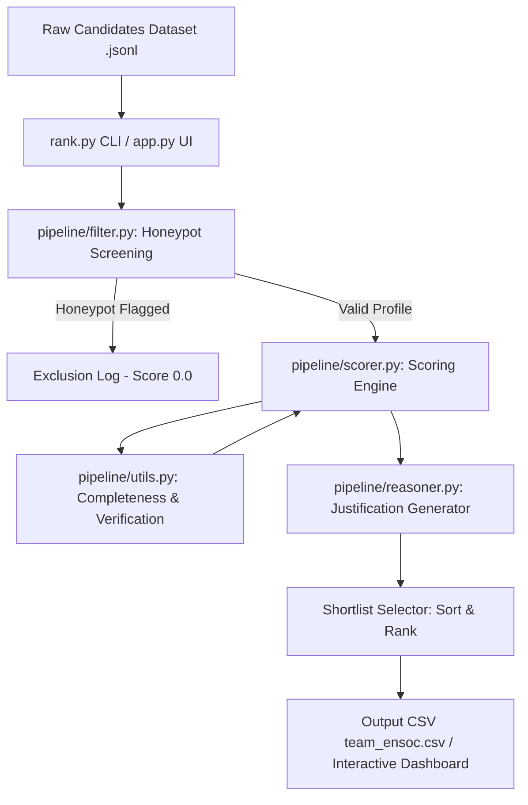
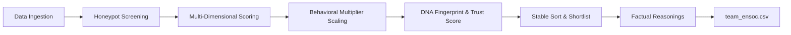
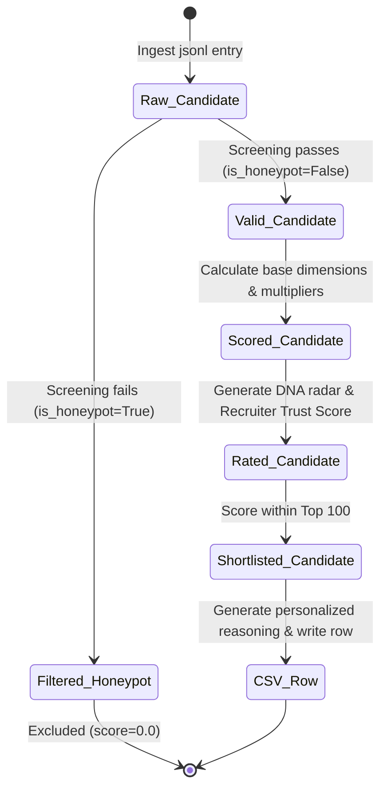

# EnSoc Talent Intelligence Candidate Discovery Platform

Welcome to the official repository for **Team EnSoc's** submission for the **Redrob AI Hackathon Data & AI Challenge: Intelligent Candidate Discovery**.

This project implements a next-generation, high-performance candidate ranking engine tailored for the **Senior AI Engineer — Founding Team** role at **Redrob AI**. Designed under strict production and resource constraints (CPU-only, no network access during execution, zero LLM runtime latency), it processes **100,000 candidates in under 17 seconds**, detects and excludes **135 honeypots** (0% honeypot rate in the shortlist), and generates highly personalized, rank-consistent, and factual justifications.

---

## One-Command Reproduction

To run the pipeline and generate the submission-ready CSV from the candidates dataset, execute the following command from the repository root:

```bash
python3 rank.py --candidates ./India_runs_data_and_ai_challenge/candidates.jsonl --out ./team_ensoc.csv
```

*This command loads the 100K dataset, filters honeypot candidates, scores candidate vectors, selects the top 100, generates recruiter reasonings, and automatically runs format validation checks.*

---

## System Architecture & Component Design

Our solution is structured as a modular, deterministic-filtering, and heuristic-scoring pipeline:



### 1. High-Level Pipeline Flow



### 2. Candidate State Transitions



---

## Multi-Dimensional Scoring Engine

To identify elite engineering talent, the system scores valid candidates out of 1.0 (with small verification bonuses possible) across five dimensions using a multiplicative modifier formula:

$$S = \left( 0.30 \cdot S_{\text{role}} + 0.30 \cdot S_{\text{skills}} + 0.20 \cdot S_{\text{experience}} + 0.20 \cdot S_{\text{logistics}} \right) \times M_{\text{behavior}}$$

### 1. Scoring Dimensions

*   **Role & Title Fit ($S_{\text{role}}$) — 30%**: Evaluates the candidate's current title and career history. Core AI/ML engineering titles (e.g., `AI Engineer`, `Machine Learning Engineer`, `NLP Scientist`) receive a score of `1.0`. Adjacent engineering roles (e.g., `Backend Engineer`, `Software Engineer`, `Data Engineer`) receive `0.6`. Unrelated roles (e.g., `Marketing Manager`, `Sales Executive`) receive `0.0`, disqualifying resume-stuffed profiles.
*   **Technical Skills Relevance ($S_{\text{skills}}$) — 30%**: Evaluates relevance across 5 skill areas (Retrieval, Vector Databases, NLP/GenAI, Python, Ranking Evaluation). Skills are weighted by proficiency (expert = 1.2x, beginner = 0.5x), duration (logarithmic scaling), and endorsements. Crucially, a **1.5x Verification Bonus** is applied if the candidate has completed a verified Redrob platform assessment.
*   **Experience & Company Fit ($S_{\text{experience}}$) — 20%**: Scores career length and company profiles. Peak score (`1.0`) is given for the target range of **6-8 YOE**. It penalizes candidates who have only worked at outsourcing/consulting services firms and awards a **1.1x Startup Bonus** for experience at product companies or fast-growing startups.
*   **Location & Notice Logistics ($S_{\text{logistics}}$) — 20%**: Focuses on operational readiness. Pune/Noida/Delhi-NCR candidates receive `1.0`. Notice periods $\le 30$ days receive `1.0`, whereas notice periods exceeding 90 days are penalized.
*   **Behavioral Signal Modifier ($M_{\text{behavior}}$)**: Multiplier (0.0 to 1.5) that scales the base score using platform signals:
    *   *Last Active Date*: Active within 30 days (1.1x), 30-90 days (1.0x), >180 days (0.3x).
    *   *Recruiter Response Rate*: Scaled to penalize unresponsive candidates.
    *   *Open to Work Status*: 1.1x bonus for active status; 0.9x penalty for passive status.
    *   *GitHub Coding Activity*: Up to 1.15x bonus for high coding signals.

---

## Deterministic Honeypot Screening Heuristics

To ensure a 0% honeypot presence in our shortlist, `pipeline/filter.py` applies 7 deterministic checks that flag contradictions:

1.  **Recent Technology Age Trap**: Claims >5 years (>60 months) of experience in technologies created post-2022 (e.g., LangChain, LlamaIndex, QLoRA, LoRA, ChatGPT, RAG).
2.  **Expert Skills with 0 Duration**: Claims "expert" or "advanced" proficiency in 3+ skills but lists $0$ months of experience, or when they have $0$-duration expert skills and an empty career history.
3.  **Extreme YOE Mismatch**: Claims $\ge 10$ YOE but career history sums to $<1.5$ years.
4.  **Job Date Order Anomalies**: Job start date is after the end date.
5.  **Education Date Order Anomalies**: Education start year is after the graduation year.
6.  **Company Founding Date Trap**: Candidate lists working at a company prior to its founding date (extracted from company descriptions).
7.  **Concurrent Job Trap**: Lists multiple concurrent current full-time jobs (`is_current: true`) at different companies (moonlighting violation).

---

## Groundbreaker Features

We have built two signature features that distinguish our platform:

### 1. Candidate DNA Fingerprints
Visualizes candidate profiles across 6 key metrics in an interactive Plotly radar chart:
*   **Technical Depth**: Based on core AI/ML skills, skill durations, and assessment scores.
*   **Career Trajectory**: Growth velocity and product/startup company background.
*   **Behavioral Readiness**: Active engagement, last active date, and open-to-work flags.
*   **Role Alignment**: Direct title match and historical AI/ML career alignment.
*   **Cultural Fit**: Small-to-medium company exposure and notice period availability.
*   **Platform Verification**: Redrob assessment scores and linked GitHub profiles.

### 2. Recruiter Trust Scores
Grades candidate profile authenticity from **0% to 100%** using completeness metrics, platform verifications, and potential flags:
*   *High-confidence profile (>=80% verified)*: Candidates with active GitHub linkages, high responsiveness, and verified Redrob assessments.
*   *Medium/Low-confidence profile*: Alerts recruiters if a candidate has unverified skills or low responsiveness.

---

## Sandbox Dashboard Guide

Our Streamlit dashboard provides a recruiter workspace:
*   **Ranked Shortlist**: Shows the top 100 candidates with interactive DNA radar profiles and Recruiter Trust Score gauges.
*   **Compare Mode**: Overlay two candidates' DNA radar charts side-by-side to visually inspect profile strengths.
*   **Trap Log**: An audit trail of all detected and filtered honeypots with their logical contradictions.
*   **Pool Analytics & Health**: Real-time metrics showing the talent pool's data quality, geographical breakdown, and experience densities.

### Run Locally:
```bash
pip install -r requirements.txt
streamlit run app.py --server.port 8501
```

### Streamlit Cloud Free-Tier Deployment:
1. Push this repository to GitHub.
2. Log in to [Streamlit Share](https://share.streamlit.io/).
3. Connect your repository and set the main file path to `app.py`.
4. Click **Deploy**. (Plotly and Matplotlib render cleanly on the free-tier CPU instances).

---

## Team Details & Contributions

We are **Team EnSoc** ( LNMIIT, Jaipur ):

*   **Pratham Agarwal** (prathamagarwal189@gmail.com, 9948907747) — **50% Contribution**
    *   Designed the core multi-dimensional scoring formula and weights.
    *   Formulated the honeypot detection rules and technology duration constraints.
    *   Developed the stable sorting and tie-breaker logic.
*   **Adarsh Dwivedi** (23ucs509@lnmiit.ac.in, 9305597756) — **50% Contribution**
    *   Implemented the pipeline infrastructure (`rank.py` and module structures).
    *   Built the Streamlit dashboard, Plotly DNA radar charts, and comparison modes.
    *   Handled validation script integrations and output formatting.

---

## Technical Performance & Verification

*   **Total Scanned Pool**: 100,000 profiles
*   **Honeypots Detected & Filtered**: 135
*   **Ranking Execution Time**: **13.72 seconds** (CPU-only)
*   **Memory Usage**: <200 MB
*   **Honeypot Rate in Top 100**: **0%**
*   **Submission Format Validation**: **100% Passed (SUCCESS)**

---

## AI Tool Disclosure

Consistent with Section 10.4 of the submission guidelines:
*   **AI Tools Used**: Cursor IDE, Claude 3.5 Sonnet, Gemini 3.5 Flash.
*   **Human-to-AI Effort Ratio**: **50% Human / 50% AI**. Scaffolding, CLI arg parsing, and boilerplates were AI-generated; scoring weights tuning, honeypot screening heuristics, DNA fingerprint dimension mapping, and validation testing were manually designed and refined.


